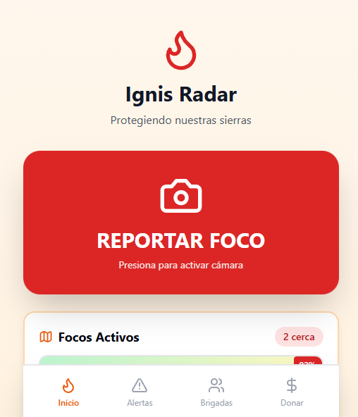
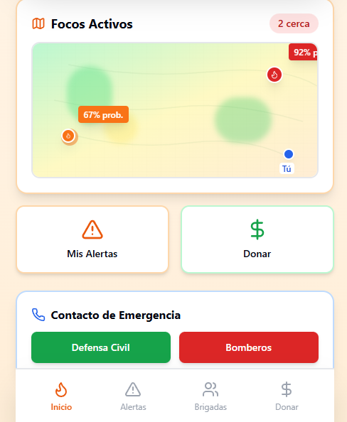
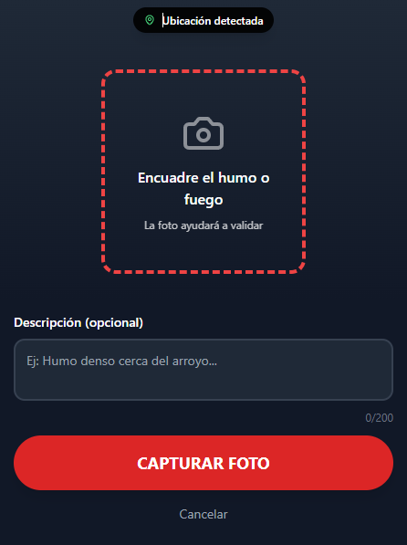
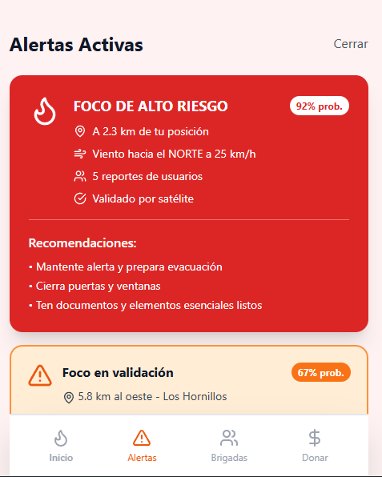
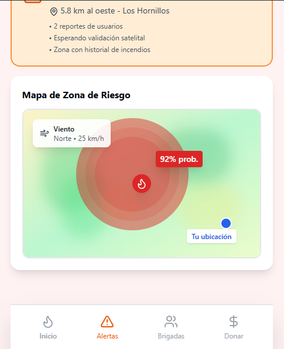
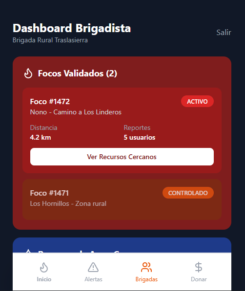
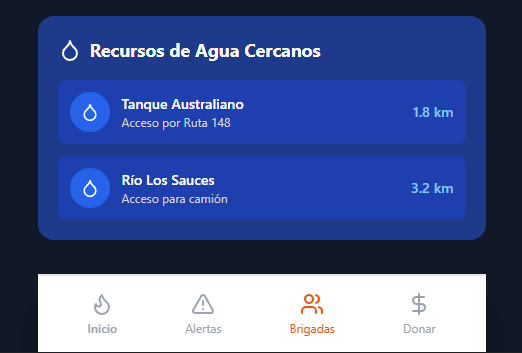
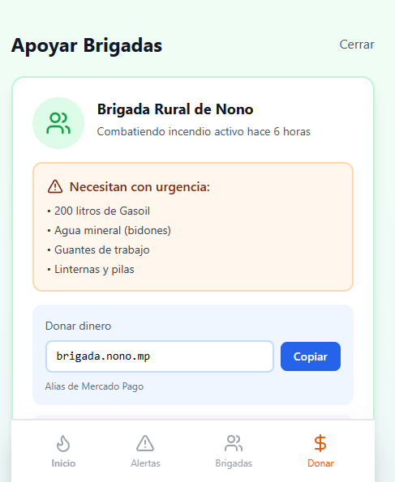
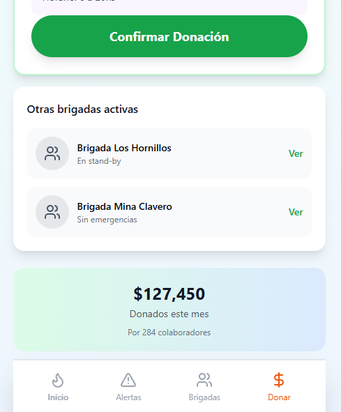

# 🔥 Ignis Radar

> **Citizen Wildfire Detection and Reporting System**  

**Ignis Radar** is a mobile-first React PWA for wildfire detection and coordinated response in the Traslasierra mountain range of Córdoba, Argentina. It connects three actors in a single ecosystem:

- 👤 **Citizens** report fire outbreaks from their phone camera with geo-referenced photo evidence.
- 🚒 **Firefighters** access a field dashboard with validated incidents, water sources, and distances.
- 🤝 **Collaborators** donate money or supplies directly to active brigades in real time.

Each citizen report is cross-referenced with satellite data and nearby report density to produce a **probability confidence index** (e.g. 92%, 67%) that prioritizes the operational response.

---

> [!WARNING]
> **⚠️ PROTOTYPE NOTICE**  
> This is a **UI prototype only**, built entirely with **Claude AI** (Anthropic). All data displayed (fire locations, probabilities, distances, donations) is **hardcoded and static**. No real backend, live satellite feed, or geolocation API is connected. This prototype is intended for demonstration, concept validation, and fundraising purposes only.

---

## 📸 Images Demo

<table>
  <tr>
    <td align="center"></td>
    <td align="center"></td>
    <td align="center"></td>
  </tr>
  <tr>
    <td align="center"></td>
    <td align="center"></td>
    <td align="center"></td>
  </tr>
  <tr>
    <td align="center"></td>
    <td align="center"></td>
    <td align="center"></td>
  </tr>
</table>

---

## 📋 Table of Contents

- [Overview](#-overview)
- [Screenshots](#-screenshots)
- [System Architecture](#️-system-architecture)
- [Features](#-features)
- [Tech Stack](#️-tech-stack)
- [Installation & Setup](#-installation--setup)
- [Project Structure](#-project-structure)
- [Screens & Flows](#️-screens--flows)
- [Roadmap](#️-roadmap)
- [Contributing](#-contributing)
- [License](#-license)

---

## 📌 Overview

**Ignis Radar** is a mobile-first progressive web application (PWA) designed for the **early detection, citizen reporting, and coordinated response** to wildfire outbreaks in the Sierras de Traslasierra region of Córdoba, Argentina.

The system connects three key actors within a single digital ecosystem:

| Actor | Role |
|-------|------|
| 👤 **Citizen** | Reports fire outbreaks with photo evidence and geolocation via the device camera |
| 🚒 **Firefighter** | Accesses the operational dashboard with validated incidents, water resources, and distances |
| 🤝 **Collaborator** | Provides financial and material support to active brigades during emergencies |

The validation model cross-references citizen reports with **satellite data** and the geographic density of incoming reports, generating a probability index per incident (e.g., 92%, 67%) that prioritizes the operational response.

---

## 📸 Screenshots

> *(Add screenshots here once the project is deployed)*

```
[ Home ]       [ Report ]      [ Alerts ]      [ Firefighters ]  [ Donations ]
  🏠               📷              🔔               👥               💚
```

---

## 🏛️ System Architecture

```
┌──────────────────────────────────────────────────────────┐
│                     Ignis Radar App                      │
│                  (React SPA - Mobile First)              │
├──────────────┬──────────────┬────────────┬───────────────┤
│  HomeScreen  │ ReportScreen │AlertsScreen│DonationsScreen│
│              │              │            │               │
│  - Map       │  - Camera    │  - Alerts  │  - Brigades   │
│  - Alerts    │  - Preview   │  - Map     │  - Donations  │
│  - Contacts  │  - Submit    │  - Wind    │  - Resources  │
└──────────────┴──────┬───────┴────────────┴───────────────┘
                      │
              ┌───────▼────────┐
              │ConfirmationScr │
              │  - Status      │
              │  - Validation  │
              └───────┬────────┘
                      │
         ┌────────────▼─────────────┐
         │     BrigadistScreen      │
         │  - Validated incidents   │
         │  - Water resources       │
         │  - Operational mgmt      │
         └──────────────────────────┘
```

### Navigation Model

The application implements a **finite state machine pattern** for screen navigation, controlled by a single central state variable `currentScreen`. Transitions are deterministic and unidirectional, ensuring consistency throughout the user flow.

```
home ──► report ──► confirmation ──► home
  │
  ├──► alerts
  ├──► brigadist
  └──► donations
```

---

### 🧮 Validation Engine & Probability Score

Every incoming report is processed by a **multi-factor scoring pipeline** that aggregates weighted signals to produce a single probability confidence index (0–100%). This index is the primary criterion for classifying an incident as HIGH risk (≥ 80%) or MEDIUM risk (< 80%), and for deciding whether it reaches the firefighter operational dashboard.

The score is composed of three independent factor groups:

#### 1. Visual Evidence Weight

| Condition | Score contribution |
|-----------|-------------------|
| Report includes a photo captured in real time | **+45 pts** |
| Report is text-only (no image attached) | **+10 pts** |
| Photo metadata timestamp matches report time (< 60 s delta) | **+10 pts** additional |

A photo captured at the moment of reporting is the single most valuable credibility signal. It demonstrates physical proximity to the event and provides a visual artifact for downstream satellite cross-validation.

#### 2. Geographic Clustering Density

Reports are spatially grouped using a **radius-based clustering algorithm** (default cluster radius: 500 m). As independent reports from different users converge on the same coordinates, the cluster score escalates non-linearly:

| Reports in cluster | Cumulative score boost |
|--------------------|------------------------|
| 1 (isolated) | baseline |
| 2 | **+15 pts** |
| 3 | **+25 pts** |
| 5+ | **+35 pts** (cap) |

The non-linear weighting is intentional: a single report could be a mistake or a controlled burn; five independent reports within 500 m are unlikely to be coincidental.

#### 3. Spatial Data Cross-Reference

Once a cluster reaches a minimum threshold (≥ 2 reports or ≥ 1 photo report), the pipeline queries two external data sources and applies a final adjustment:

| Data source | Condition | Score contribution |
|-------------|-----------|-------------------|
| **Satellite thermal anomaly** (NASA FIRMS / Sentinel-2) | Thermal hotspot detected within 1 km radius | **+20 pts** |
| **Meteorological variables** (wind speed, relative humidity, drought index) | High-risk weather conditions active at report location | **+10 pts** |

Satellite confirmation alone can push a medium-confidence cluster (e.g. 67%) past the HIGH risk threshold, triggering immediate alerts to nearby users and the firefighter dashboard.

#### Score composition summary

```
P(incident) = VisualEvidence + ClusterDensity + SpatialCrossRef
            = [10–65]        + [0–35]         + [0–30]
            = 0 – 100 %
```

> **Note:** In the current prototype all scores are static and hardcoded. The pipeline above describes the intended production model targeted for v1.1.

---

## ✨ Features

### Citizen Module

- **Photo-evidence fire reporting**: direct integration with the device's rear camera via the HTML5 `capture="environment"` attribute, with no external camera dependencies.
- **Image preview before submission**: the report is not transmitted until the user confirms the capture, reducing false positives.
- **Optional text description**: 200-character field to provide context about the emergency.
- **Automatic geolocation**: device location is detected at the moment of the report (visual indicator on screen).
- **Real-time active fire map**: topographic visualization with animated probability markers and color-coded risk levels.

### Alerts Module

- **Risk level system**: classifies incidents as HIGH (≥80%) and MEDIUM (<80%) with visual color coding.
- **Integrated weather data**: wind direction and intensity overlaid on the risk map.
- **Cross-validation**: each alert indicates whether it has been verified by satellite data or is still pending validation.
- **Evacuation recommendations**: action guide for citizens based on the incident risk level.
- **Geospatial danger radius**: projected impact zone visualization with pulsing animation.

### Firefighter Module (Operational Dashboard)

- **Validated incident panel**: prioritized list with unique ID, location, number of citizen reports, and operational status (ACTIVE / CONTROLLED).
- **Nearby water resource inventory**: map of water tanks, rivers, and truck-accessible water sources with calculated distances.
- **High-contrast interface**: dark-palette design optimized for readability in field conditions (direct sunlight, operational stress).

### Donations & Logistics Module

- **Per-brigade urgent needs profile**: updated list of critical supplies (fuel, water, PPE).
- **Digital monetary donations**: Mercado Pago alias integrated with clipboard copy functionality.
- **Physical collection point**: address and hours of the material drop-off center.
- **Community impact metrics**: total donated in the period and number of participating collaborators.
- **Active brigade listing**: visibility into the operational status of brigades across the region.

### Emergency Contact

- One-tap direct access to **Civil Defense** and **Fire Department** from the home screen.

---

## 🛠️ Tech Stack

| Category | Technology | Recommended Version |
|----------|-----------|---------------------|
| UI Framework | [React](https://react.dev/) | ^18.x |
| Language | TypeScript (TSX) | ^5.x |
| Styling | [Tailwind CSS](https://tailwindcss.com/) | ^3.x |
| Icons | [Lucide React](https://lucide.dev/) | ^0.4xx |
| Bundler | Vite / Next.js | — |
| Target | Mobile-first PWA | — |

### UI dependencies used

```typescript
import {
  Camera, MapPin, Flame, Users, Droplet,
  Wind, Phone, DollarSign, AlertTriangle,
  CheckCircle, Clock, Map
} from 'lucide-react';
```

---

## 🚀 Installation & Setup

### Prerequisites

- Node.js `>=18.0.0`
- npm `>=9.0.0` or pnpm `>=8.0.0`

### Steps

```bash
# 1. Clone the repository
git clone https://github.com/your-username/Ignis Radar.git
cd Ignis Radar

# 2. Install dependencies
npm install

# 3. Install UI dependencies
npm install lucide-react
npm install -D tailwindcss postcss autoprefixer
npx tailwindcss init -p

# 4. Start the development server
npm run dev
```

---

## 📁 Project Structure

```
ignis-radar/
├── index.html                  # HTML entry point (Vite)
├── package.json
├── vite.config.ts
├── tailwind.config.js
├── postcss.config.js
├── tsconfig.json
├── tsconfig.node.json
├── .gitignore
├── README.md
└── src/
    ├── main.tsx                # React DOM entry point
    ├── index.css               # Tailwind base directives
    ├── App.tsx                 # Root: router + screen composer
    ├── types/
    │   └── index.ts            # Shared types (ScreenName, NavigationProps)
    ├── hooks/
    │   ├── useNavigation.ts    # Screen-routing state
    │   └── useReport.ts        # Report form state + file capture
    └── components/
        ├── navigation/
        │   └── BottomNavBar.tsx
        └── screens/
            ├── HomeScreen.tsx
            ├── ReportScreen.tsx
            ├── ConfirmationScreen.tsx
            ├── AlertsScreen.tsx
            ├── BrigadistScreen.tsx
            └── DonationsScreen.tsx
```

### Architecture & SOLID principles applied

| Principle | Application |
|-----------|-------------|
| **SRP** | Each screen component owns only its own UI; state logic lives in dedicated hooks (`useNavigation`, `useReport`) |
| **OCP** | Adding a new screen requires only: a new `ScreenName` union member, a new component file, and one `case` in `App.tsx` |
| **LSP** | All screen components satisfy the same `NavigationProps` interface and are interchangeable in the router |
| **ISP** | `ReportScreen` receives only `onCancel`/`onSubmit` callbacks — it never touches the navigation hook directly |
| **DIP** | `App.tsx` depends on the `ScreenName` type abstraction, not on concrete screen implementations |

---

## 🖥️ Screens & Flows

### 1. `HomeScreen` — Home

**Purpose**: entry point and citizen command center.

| Element | Behavior |
|---------|----------|
| "REPORT FIRE" button | Navigates to `ReportScreen` |
| Active fire map | Displays 2 incidents with animated probabilities (92% and 67%) |
| "My Alerts" button | Navigates to `AlertsScreen` |
| "Donate" button | Navigates to `DonationsScreen` |
| Civil Defense / Fire Dept | Emergency contact buttons |

---

### 2. `ReportScreen` — Fire Report

**Purpose**: photographic evidence capture and report submission.

**User flow:**
```
Open screen
    └──► No image: show framing guide
              └──► Tap "CAPTURE PHOTO" → triggers input[capture="environment"]
                        └──► Image selected → show preview
                                  └──► Tap "SUBMIT REPORT"
                                            └──► Loading animation → navigate to ConfirmationScreen
```

**Image handling:**
- `FileReader.readAsDataURL()` is used to generate a base64 preview with no server persistence (prototype behavior).
- The `accept="image/*"` attribute combined with `capture="environment"` instructs the mobile OS to open the rear camera directly.

---

### 3. `ConfirmationScreen` — Submission Confirmation

**Purpose**: positive user feedback and description of the validation pipeline.

Displays `Under validation` status with contextual information:
- Inferred location: `Nono, Valle de Traslasierra`
- Next step: cross-referencing with satellite data and nearby reports

---

### 4. `AlertsScreen` — Community Alerts

**Purpose**: active alert consumption for general citizens.

| Incident | Probability | Distance | Status |
|----------|:-----------:|:--------:|--------|
| Nono (high risk) | 92% | 2.3 km | Satellite validated |
| Los Hornillos | 67% | 5.8 km | Pending validation |

Includes danger radius map with wind direction and intensity visualization.

---

### 5. `BrigadistScreen` — Firefighter Operational Dashboard

**Purpose**: high-contrast field interface for use by firefighting brigades.

- **Incident #1472**: Nono - Camino a Los Linderos | ACTIVE | 4.2 km
- **Incident #1471**: Los Hornillos | CONTROLLED
- Nearby water resources:
  - Australian Water Tank — 1.8 km (Route 148)
  - Los Sauces River — 3.2 km (truck access)

---

### 6. `DonationsScreen` — Logistics & Donations

**Purpose**: channeling citizen support to active brigades.

- Brigada Rural de Nono (currently fighting an active fire)
- Urgent needs: diesel fuel, water, gloves, flashlights
- Digital channel: Mercado Pago alias `brigada.nono.mp`
- Physical channel: Municipalidad de Nono, Av. San Martín 450
- Impact: **$127,450 donated** by 284 collaborators this month

---

## 🗺️ Roadmap

### v1.0 — MVP *(current — prototype)*
- [x] Citizen reporting with photo and geolocation
- [x] Active fire map with probability indicators
- [x] Alerts with basic weather data
- [x] Operational dashboard for firefighters
- [x] Integrated donation channel
- [x] One-tap emergency contacts

### v1.1 — Real Data Integration
- [ ] Real-time geolocation API integration (Mapbox / Leaflet)
- [ ] Wind data API integration (OpenWeatherMap / SMHN)
- [ ] Report validation backend (Node.js / FastAPI)
- [ ] Image storage (S3 / Cloudinary)

### v1.2 — Notifications & Authentication
- [ ] Push notifications for proximity alerts (Firebase FCM)
- [ ] Role-based authentication (citizen / firefighter)
- [ ] Admin panel for incident management

### v2.0 — Artificial Intelligence
- [ ] Computer vision model for automatic image validation
- [ ] Fire spread prediction based on wind and vegetation
- [ ] Satellite imagery integration (NASA FIRMS / Sentinel-2)

---

## 📄 License

This project is licensed under the **MIT License**.  
Free to use, modify, and distribute with attribution.

---

## 👤 Author & Context

**Ignis Radar** was born out of the need for accessible digital tools for the early detection of wildfires in the mountain ranges of Córdoba, Argentina. The Traslasierra region has suffered devastating fires in recent years, and this system aims to strengthen the community's and firefighters' response capacity through low-cost, highly accessible technology.

> This prototype was designed and built with the assistance of **Claude AI** by Anthropic as a proof of concept. All UI, logic, and flows were generated through AI-assisted development.

